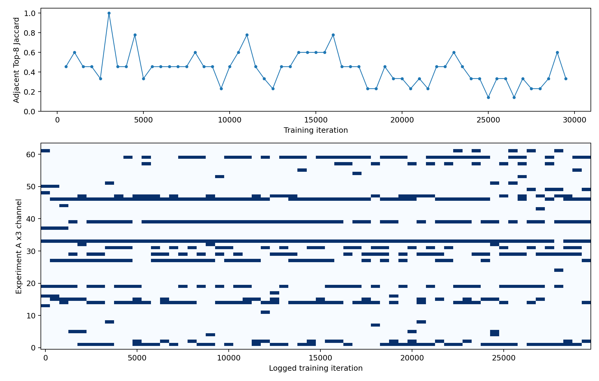

# Experiment A-D2 — Prediction Topology and BGS Stability Check

Baseline EMA 27000 与 Experiment A EMA 29000 在相同 20 个 LA 病例上重新推理。全部病例（包括预先指定异常病例）进入每项均值和配对统计，没有删除任何病例。

直接实测：全 20 例的平均 Dice 差（Guidance−Baseline）由 raw 的 +0.003678 变为 LCC 的 -0.010703。因此，LCC 导致这两个 checkpoint 的平均 Dice 排名反转。这说明当前最终评估差距受到预测拓扑与后处理的直接影响；不证明 BGS 排序漂移是训练退化的因果来源。

## 方法与保护

- 直接调用原 `prediction.test_single_case` 与 `getLargestCC`；patch `[112,112,80]`，stride `(18,18,4)`，前景概率 `>0.5`，26 邻接连通域。
- 输入直接读取原 `mri_norm2.h5/image`；没有重新归一化、增强或重采样。
- 四个指标直接调用原 `calculate_metric_percase`；HD95/ASD 单位为 voxel（原数据没有 spacing），ASD 沿用原有预测表面到 GT 的单向定义。空预测沿用原代码的 Dice/Jaccard=0、HD95/ASD=100。
- 原始五个受保护源文件、全部既有 Results 文件与上一版诊断文件，运行前后 SHA256 完全一致。
- 全程 eval / inference_mode；模型参数与 buffers 逐张量不变，没有训练、反向传播或新增 BN 设置。
- 异常病例的重新推理 raw / LCC masks 与上一版已保存 masks 逐 voxel 一致；连通域 overlap 分析直接读取上一版已保存的 raw masks 和 GT。
- 实际执行设备：`cuda:0`。完整来源与哈希见 `diagnosis_v2_metadata.json` 和 `verification.json`。

## 直接观察到的事实

### 全部 20 例：原始阈值预测与 LCC

`delta = guidance − baseline`；Dice/Jaccard 负值、HD95/ASD 正值表示 Guidance 更差。

| 模型 | 预测 | Dice | Jaccard | HD95 | ASD | FP mean | FN mean | 预测体积 mean |
|---|---|---|---|---|---|---|---|---|
| baseline | raw | 0.840010 | 0.729216 | 23.283018 | 6.940073 | 38407.8 | 37662.4 | 239170.5 |
| guidance | raw | 0.843688 | 0.735486 | 23.575082 | 6.638701 | 36398.4 | 38326.5 | 236497.1 |
| baseline | lcc | 0.873561 | 0.777685 | 8.888792 | 2.208702 | 21325.6 | 38079.9 | 221670.9 |
| guidance | lcc | 0.862858 | 0.764721 | 11.416208 | 3.093234 | 26570.6 | 38824.8 | 226171.0 |

| 指标 | raw 配对平均 delta | LCC 配对平均 delta | LCC 对 signed gap 的变化 |
|---|---:|---:|---:|
| dice | +0.003678 | -0.010703 | -0.014381 |
| jaccard | +0.006271 | -0.012963 | -0.019234 |
| hd95 | +0.292065 | +2.527417 | +2.235352 |
| asd | -0.301372 | +0.884533 | +1.185904 |

逐病例差异与 LCC gap 变化见 `paired_raw_vs_lcc.csv`。绝对 gap 变化与 signed gap 分别保存，避免把排名反转误称为简单放大/缩小。

逐病例 Dice gap（正值为 Guidance 更高；widened/narrowed 指绝对差距放大/缩小）：

| 病例 | raw Dice delta | LCC Dice delta | LCC gap effect |
|---|---|---|---|
| UPT6DX9IQY9JAZ7HJKA7 | +0.003944 | +0.003793 | narrowed |
| UTBUJIWZMKP64E3N73YC | +0.014367 | +0.002599 | narrowed |
| ULHWPWKKLTE921LQLH1P | -0.005724 | -0.008073 | widened |
| V0MZOWJ6MU3RMRCV9EXR | -0.022477 | -0.009575 | narrowed |
| VDOF02M8ZHEAADFMS6NP | +0.010357 | -0.007952 | ranking_reversed_narrowed |
| VG4C826RAAKVMV9BQLVD | +0.021022 | +0.013872 | narrowed |
| VIXBEFTNVHZWKAKURJBN | -0.001254 | -0.001079 | narrowed |
| VQ2L3WM8KEVF6L44E6G9 | -0.014073 | -0.009896 | narrowed |
| WBG9WYZ1B25WDT5WAT8T | +0.016850 | +0.004893 | narrowed |
| WMDG2EFA6L2SNDZXIRU0 | +0.014769 | +0.004908 | narrowed |
| WNPKE0W404QE9AELX1LR | -0.024255 | -0.014579 | narrowed |
| WSJB9P4JCXUVHBOYFVWL | -0.048765 | -0.189756 | widened |
| WW8F5CO4S4K5IM5Z7EXX | -0.011603 | +0.009078 | ranking_reversed_narrowed |
| X18LU5AOBNNDMLTA0JZL | +0.065082 | -0.001415 | ranking_reversed_narrowed |
| XYDLYJ5CS19FDBVLJIPI | +0.037275 | +0.019802 | narrowed |
| Y7ZU0B2APPF54WG6PDMF | +0.000176 | -0.002955 | ranking_reversed_widened |
| YDKD1HVHSME6NVMA8I39 | +0.024636 | -0.005828 | ranking_reversed_narrowed |
| Z9GMG63CJLL0VW893BB1 | +0.022998 | +0.016515 | narrowed |
| ZIJLJAVQV3FJ6JSQOH1E | -0.040320 | -0.039151 | narrowed |
| ZQPMJ4XEC5A4BISD45P1 | +0.010559 | +0.000742 | narrowed |

- dice：LCC 后 Guidance 劣于 Baseline 的病例 11/20；LCC 使 Guidance 的相对表现下降。
- jaccard：LCC 后 Guidance 劣于 Baseline 的病例 11/20；LCC 使 Guidance 的相对表现下降。
- hd95：LCC 后 Guidance 劣于 Baseline 的病例 11/20；LCC 使 Guidance 的相对表现下降。
- asd：LCC 后 Guidance 劣于 Baseline 的病例 11/20；LCC 使 Guidance 的相对表现下降。

### 异常病例 WSJB9P4JCXUVHBOYFVWL

GT 前景为 171083 voxels。以下组件按体积降序排名，保留原 label ID；全部组件明细见 `anomaly_component_gt_overlap.csv`。

| 模型 | 体积 rank | 组件 ID | 体积 | GT overlap / TP | FP | 覆盖 GT 比例 | LCC 保留 |
|---|---|---|---|---|---|---|---|
| baseline | 1 | 11 | 138050 | 123401 | 14649 | 0.721293 | 1 |
| baseline | 2 | 2 | 55323 | 0 | 55323 | 0.000000 | 0 |
| guidance | 1 | 2 | 230572 | 122226 | 108346 | 0.714425 | 1 |
| guidance | 2 | 7 | 11031 | 0 | 11031 | 0.000000 | 0 |

异常病例性能：

| 模型 | 预测 | Dice | HD95 | TP | FP | FN | 组件数 | 最大组件占比 |
|---|---|---|---|---|---|---|---|---|
| baseline | raw | 0.641880 | 50.566788 | 124636 | 92628 | 46447 | 23 | 0.635402 |
| baseline | lcc | 0.798368 | 17.233688 | 123401 | 14649 | 47682 | 1 | 1.000000 |
| guidance | raw | 0.593115 | 52.236003 | 125926 | 127617 | 45157 | 29 | 0.909400 |
| guidance | lcc | 0.608612 | 53.740115 | 122226 | 108346 | 48857 | 1 | 1.000000 |

异常病例 Dice 差由 raw 的 -0.048765 变为 LCC 的 -0.189756；绝对差距增加 0.140992。

LCC 对混淆计数的直接影响：

| 模型 | 删除 TP | 删除 FP | 增加 FN |
|---|---|---|---|
| baseline | 1235 | 77979 | 1235 |
| guidance | 3700 | 19271 | 3700 |

Guidance 相对 Baseline raw 新增 FP 58634 voxels；其中 51014（87.00%）属于 Guidance 体积 rank 1 / ID 2。
Guidance raw 同时丢失 Baseline 已命中的 GT voxel 9897，新增命中 GT voxel 11187。

Guidance 最大组件与 Baseline raw 最大、第二大组件的空间交集分别为 125441、44354 voxels。这是两个最终预测的空间对应关系，不能据此重建训练过程中发生过的组件合并事件。

远距离 FP：计算每个 FP 到最近 GT 前景 voxel 的欧氏距离；10/20/30 voxel 是报告用阈值，不是物理距离或临床标准。

| 模型/FP 集合 | FP 数 | 距离 median | 距离 P95 | 距离 max | >10 | >20 | >30 |
|---|---|---|---|---|---|---|---|
| baseline/raw | 92628 | 32.265 | 59.621 | 69.878 | 78732 | 72295 | 51518 |
| baseline/lcc | 14649 | 2.236 | 10.863 | 18.111 | 954 | 0 | 0 |
| guidance/raw | 127617 | 30.000 | 58.523 | 68.993 | 99622 | 84730 | 63806 |
| guidance/lcc | 108346 | 31.177 | 59.304 | 68.993 | 81135 | 70635 | 56358 |
| guidance/new_fp_relative_to_baseline_raw | 58634 | 22.913 | 55.830 | 68.250 | 42677 | 31897 | 23166 |

实测新增 FP 中 31897 个距 GT 超过 20 voxels，最大距离 68.250 voxels。

### Experiment A 自身的 BGS Top-8 稳定性

- 期望 60 条；有效实测 60 条。
- 缺失 iteration：`[]`；无效记录：`[]`；非计划 iteration：`[]`。没有补造任何 Top-8。
- 相邻 500 次实测记录共有 59 对；Jaccard 均值 `0.43479797039119067`，最小/最大 `0.14285714285714285` / `1.0`。
- 所有有效记录的严格交集：`[]`。
- 全程出现频率 ≥80% 的集合：`[33, 46]`；每个阶段均 ≥80% 的集合：`[33]`。

早/中/晚阶段固定为 [0,10000)、[10000,20000)、[20000,30000)。下表 frequency Top-8 按该阶段出现次数排序、平局按 channel ID；不是虚构的瞬时 Top-8。

| 阶段 | 实测记录 | 阶段内相邻 Jaccard mean | 阶段严格交集 | 频率 Top-8 |
|---|---|---|---|---|
| early | 20 | 0.4910399541978489 | [33] | [33, 46, 27, 39, 14, 19, 1, 29] |
| middle | 20 | 0.4787551629656892 | [33] | [33, 39, 46, 59, 14, 27, 1, 19] |
| late | 20 | 0.33889969679443355 | [] | [33, 1, 39, 29, 46, 59, 19, 31] |

阶段 frequency Top-8 集合对比：

| 阶段 1 | 阶段 2 | Jaccard | 共有 channel |
|---|---|---|---|
| early | middle | 0.7777777777777778 | [1, 14, 19, 27, 33, 39, 46] |
| early | late | 0.6 | [1, 19, 29, 33, 39, 46] |
| middle | late | 0.6 | [1, 19, 33, 39, 46, 59] |

最高频 channel（全部 64 个 channel 的完整频率见 CSV）：

| channel | 次数/有效记录 | 频率 | 最长连续 500 次记录数 | 起止 iteration |
|---|---|---|---|---|
| 33 | 59/60 | 0.9833 | 56 | 0–27500 |
| 46 | 48/60 | 0.8000 | 24 | 500–12000 |
| 39 | 46/60 | 0.7667 | 22 | 5500–16000 |
| 1 | 35/60 | 0.5833 | 6 | 18500–21000 |
| 14 | 34/60 | 0.5667 | 6 | 13500–16000 |
| 59 | 33/60 | 0.5500 | 7 | 21000–24000 |
| 27 | 32/60 | 0.5333 | 9 | 500–4500 |
| 19 | 31/60 | 0.5167 | 5 | 25000–27000 |
| 29 | 30/60 | 0.5000 | 5 | 27000–29000 |
| 31 | 24/60 | 0.4000 | 3 | 3500–4500 |
| 47 | 21/60 | 0.3500 | 4 | 19500–21000 |
| 15 | 17/60 | 0.2833 | 4 | 500–2000 |

连续记录只证明这些采样时点持续入选，不证明两次日志之间的 499 次排序完全不变。Top-8 是 training Student 当前 labeled batch 的 w 排序诊断，不是 EMA Teacher 的推理排序，也不是 hard Top-K guidance；仅分析 Experiment A 自身，不对齐 Baseline 的 channel index。



## 可能的机制解释

- 当错误区域属于预测最大连通域时，LCC 会保留它；当 Baseline 的错误区域在次级组件时，LCC 可能更有效地改善 Baseline，进而扩大最终性能差距。上文的组件 TP/FP 和 gap 变化可直接检验这一描述。
- 新增远距离 FP、最大组件内错误体积和 GT overlap 描述了当前失败形态，可能与边界选择或训练期优化偏移有关；没有时间连续的同病例预测证据，不能确定形成过程。
- 高频通道核心与外围 Top-8 更替可以同时存在。跨阶段漂移可能来自训练进展或 labeled batch 差异；日志没有固定同一 batch，也没有记录全部 channel 分数及第 8/9 名间隔，不能区分这些解释。

## 仍需新训练实验验证的假设

- BGS 排序漂移是否导致最终远距离 FP 或 Dice 下降，仍需独立 seed、固定诊断 batch 与反事实训练对照。
- 上一版已观察到的 BN batch 耦合是否是最终退化的因果来源，当前拓扑与排序分析无法证明。
- 是否应修改 guidance、损失、特征交互或 BN，需要独立实验；本阶段没有实现或运行这些变化。

## 产物与复现

- `prediction_raw_vs_lcc.csv`：20×2×2=80 行，四个指标、TP/FP/FN、体积和连通域统计。
- `paired_raw_vs_lcc.csv`：全部 20 例 raw/LCC 模型差及 gap 变化。
- `anomaly_component_gt_overlap.csv`：两模型所有 raw 组件与 GT overlap、新增 FP 分配及空间交集。
- `anomaly_lcc_confusion_effect.csv` / `anomaly_fp_distance_to_gt.csv`：LCC TP/FP/FN 效应及远距离 FP。
- `bgs_topk_temporal_stability.csv`：计划时点实测/缺失状态、相邻 Jaccard、进入/退出 channel。
- `bgs_channel_top8_frequency.csv`、`bgs_phase_summary.csv`、`bgs_phase_pair_comparison.csv`：全通道和阶段统计。
- `masks/`：20 例 GT、两模型 raw mask 及 LCC mask，供后续独立复核。
- `verification.json`：80 行覆盖、既有指标复现、旧 masks 一致、模型状态不变、保护文件哈希验证。

```bash
conda run -n SSL python -u analysis/experiment_A_diagnosis_v2.py --device cuda:0
```
